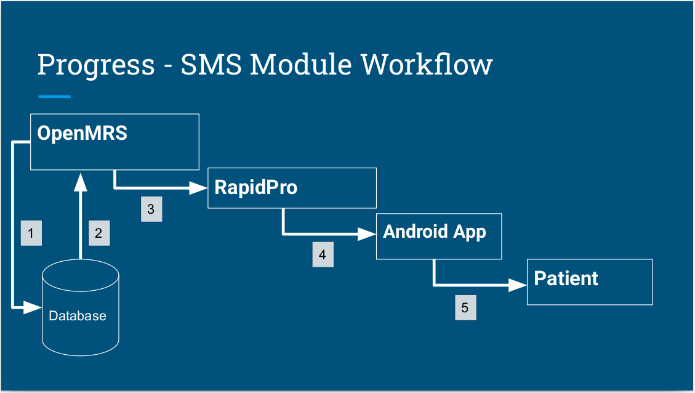

-----
## SGS Messaging Module
#### Description

An OpenMRS module that can consume results/output of an OpenMRS reporting module report and create SMS objects to be sent via RapidPro . Each night, an OpenMRS scheduled task runs the report and the SMS Module will read the Excel output of the report to create SMS objects into the OpenMRS database. A second scheduled task will run to read from the OpenMRS database the pending SMSs and send those to the corresponding patients

#### Workflow

1. Parse the output of the SMS report and create SMS objects into the OpenMRS database with assigned status as OUTBOX
2. OpenMRS sheduled task triggers the module to load all the ‘OUTBOX’ messages and 
3. Post the messages to RapidPro (...or Africa's Talking) REST API endpoint
4. RapidPro or Africa's Talking uses it’s configured channel (..can be an android phone) and 
5. Sends the notification to the patient.
